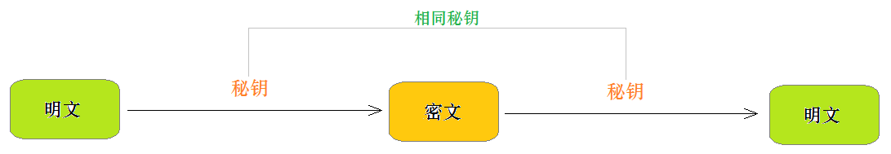
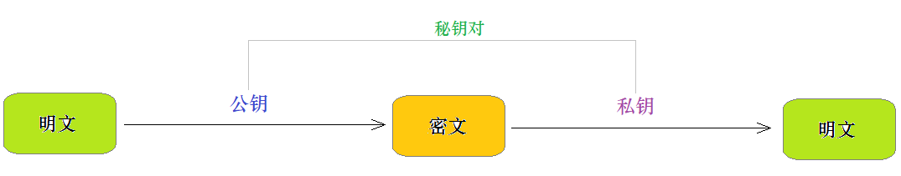

## 密码加密方式
### 可逆加密算法
加密后，密文可以反向解密得明文原文。 
___
#### 1. 对称加密
指的是加密和解密使用相同密钥的加密算法。

优点：对称加密算法的优点是算法公开，计算量小，加密速度块、加密效率高。  
缺点：没有非堆成加密安全。
常见的对称加密算法：DES、3DES、等。
#### 2. 非对称加密
指的是加密和解密使用不同密钥的加密算法。

加密和解密：
- 公钥加密，私钥解密。
- 私钥加密，私钥或公钥都可以解密。  

优点：非对称加密和对称加密相比，安全性更好。  
缺点：非对称加密和解密花费时间长，速度慢。
### 不可逆的加密算法
一旦加密就不能反向解密得到密码原文**通常用于密码数据的加密**。
常见的不可逆加密算法有：MD5、SHA、HMAC。
#### 1.MD5
MD5是比较常见的加密算法，广泛的应用与软件开发中的密码加密，通过MD5生成的密文，是无法解密得到明文密码的。但是在现在大数据背景下，很多网站通过大数据可以将简单的MD5加密的密码破解。
#### 2.Bcrypt

Bcrypt算法将salt随机并混入最终加密后的密码，验证时也无需单独提供之前的salt，从而无需单独处理salt问题。  

**每次加密的结果都不同**  
每次使用Bcrypt加密相同的密码时，生成的密文都会不同。这是因为在加密过程中，会自动生成一个随机的盐值，使得即使输入的密码相同，哈希后的结果也会不同。这样可以防止彩虹表攻击。

**怎么检验的？**  
`Bcrypt.hashpw(输入的密码，数据库中存的密码)`,首先，会从数据库从存的密码中提取盐值和工作因子。然后使用提取到的盐值和工作因子对输入的密码重新进行hash运算，然后加新得到的这个hash值与原来数据库中的值比较看看是否一致。

